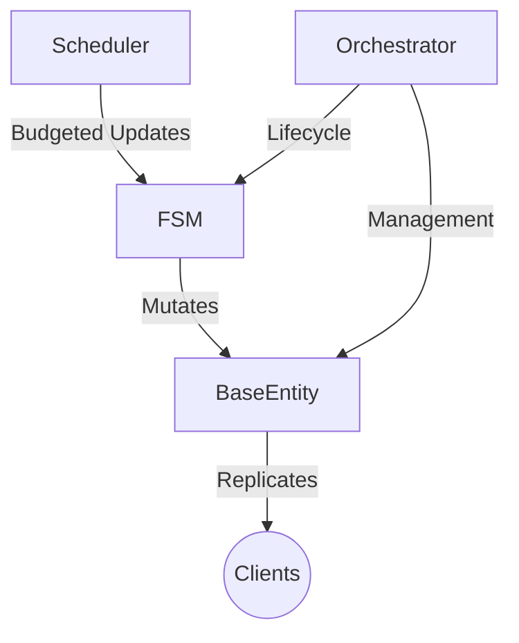

# System Architecture

RBXStateMachine follows a **Kernel-Subsystem** architecture. The **Orchestrator** acts as the kernel, managing all entities and state machines.

---

## 🖼️ The 4 Pillars

### 1. Orchestrator (Kernel)
The single source of truth for component discovery and networking.

### 2. BaseStateMachine (Brain)
Pure logical控制器 (Controller). Deterministic and transition-safe.

### 3. BaseEntity (Body)
Authoritative schema-driven data proxy.

### 4. Scheduler (Pulse)
Fair-share task runner with frame-budgeting.

---

## 🔄 Runtime Flow
1.  **Bootstrapping**: Components are registered.
2.  **Spawning**: Orchestrator creates linked Brain + Body.
3.  **Update Loop**: Scheduler slices CPU time for FSMs.
4.  **Networking**: Entity commits trigger automatic delta-replication.
5.  **Teardown**: ID-based cleanup ensures no memory leaks.
