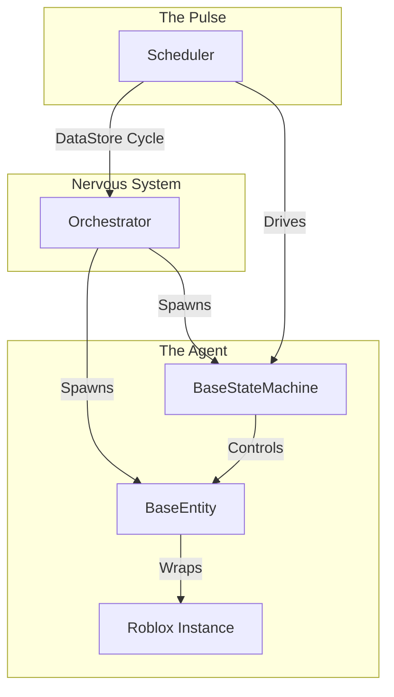

# Architecture

This framework integrates the **Brain**, **Body**, **Pulse**, and **Nervous System** of your project into a single, high-performance lifecycle.

---

## 🏗️ The 4 Pillars

| Component | Layer | Role | Analog |
| :--- | :--- | :--- | :--- |
| **Orchestrator** | Service | Global Registry & Lifecycle Manager | The Nervous System |
| **BaseStateMachine** | Logic | Behavioral flow and decision making | The Brain |
| **BaseEntity** | Data | State authority and Instance proxy | The Body |
| **Scheduler** | Timing | Async execution and frame budgeting | The Pulse |



---

## 🛰️ System Bootstrapping (Initialization)

Everything begins with the **Orchestrator**. Upon game start, the Orchestrator performs a **Discovery** phase:

1.  **Registry Compile**: Scans your folders for Entity and StateMachine registry modules.
2.  **Global Injection**: Injects the Scheduler, Logger, and Signal into the `shared` namespace.
3.  **Bridge Creation**: Creates the network bridge (Remotes) for replication and the Service Manager.

> [!IMPORTANT]
> `Orchestrator:RegisterComponents()` must be called on both the Server and Client for shared modules to correctly resolve class names.

---

## 🧬 The Spawning Flow (Creation)

When spawning objects, the systems work in a **Body-First, Brain-Second** sequence:

1.  **Body Creation**: `Orchestrator.CreateEntity` creates a proxy for the physical model and enforces a strict Schema.
2.  **Brain Creation**: `Orchestrator.CreateStateMachine` is created to control that entity.
3.  **The Link**: The Orchestrator passes the Entity into the Brain's **Context**. The Brain now has a Body to control.

---

## ⚡ The Runtime Loop (Execution)

1.  **Decision (Brain)**: The FSM or BT decides on an action.
2.  **Instruction (Brain -> Body)**: The FSM sets schema fields on the Entity (e.g., `self.Entity.IsOpen = true`).
3.  **Validation (Body)**: The Entity checks the Schema and stages the value in `Pending`.
4.  **Transaction (Commit)**: The FSM calls `self.Entity:UpdateEntity()`.
5.  **Execution (Pulse)**: The Scheduler ensures the update logic stays within the **Frame Budget**.

> [!TIP]
> Always use `self:Manage(obj)` inside your FSMs and Entities to ensure memory leaks are avoided during destruction.

---

## 📖 Architecture Concepts

*   **StateMachine**: The high-level controller managing states and transitions.
*   **Context**: A shared table (`fsm.Context`) used to store shared data.
*   **Entity Pattern**: Separates logic (decisions) from mechanism (visuals/physics).
*   **Sub-Machine**: Allows nesting complexity by running an FSM as a state of another FSM.

---

## ✅ Best Practices

1.  **Use `fsm.Context`** instead of globals.
2.  **Prioritize tasks**: Use `Render` for high-frequency UI/Visuals and `Low` for background AI.
3.  **Guard Visuals**: Use `RunService:IsClient()` inside `ApplyChanges` for purely cosmetic updates.

```lua
local RunService = game:GetService("RunService")

function MyEntity:ApplyChanges(changes)
    if not RunService:IsClient() then
        return
    end
    -- Apply visual-only changes (Tweens, ParticleEmitters, etc.)
end
```
